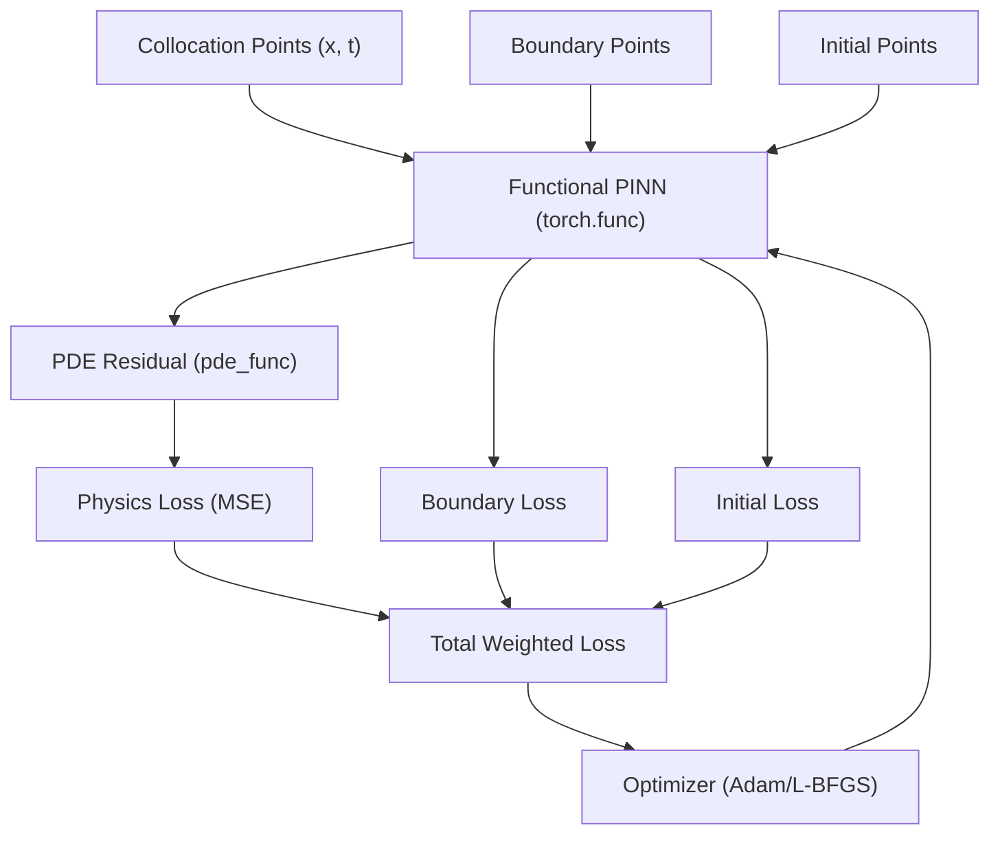

# Physics-Informed Neural Networks (PINNs) Implementation

A high-performance and optimized implementation of Physics-Informed Neural Networks (PINNs) for solving partial differential equations (PDEs) using `torch.func`.

## 📚 What are PINNs?

Physics-Informed Neural Networks (PINNs) are a class of neural networks that are trained to solve supervised learning tasks while respecting any given laws of physics described by general nonlinear partial differential equations.

### Optimization Architecture



## 🚀 Installation

### Prerequisites
- Python 3.9+
- PyTorch 2.0+ (requires `torch.func`)

### Setup

1. Install dependencies:
```bash
pip install -r requirements.txt
```

2. Install as a package (optional):
```bash
pip install -e .
```

## 🎯 Quick Start

### Solving the 1D Heat Equation

```bash
python examples/heat_equation_1d.py
```

## 💻 API Usage

### Optimized Functional API

```python
from src.pinn_model import PINN
from utils.pde_utils import PDEOperators
import torch

# Create a PINN model (automatically detects CUDA/MPS)
model = PINN(
    input_dim=2, 
    output_dim=1, 
    hidden_layers=[32, 32, 32],
    activation='tanh',
    init_type='xavier'
)

# Optional: Compile for speed
model.compile()

# Define your PDE residual using functional AD
def heat_residual(x, u_func, model, alpha=0.01):
    u_t = PDEOperators.gradient(u_func, x)[:, 1:2]
    u_xx = PDEOperators.laplacian(u_func, x)
    return u_t - alpha * u_xx

# Train the model
loss_history = model.train_model(
    optimizer=torch.optim.Adam(model.parameters(), lr=1e-3),
    n_epochs=2000,
    loss_fn=model.physics_loss,
    pde_func=heat_residual,
    x=x_collocation
)
```

## 📊 Visualization Tools

The project includes comprehensive visualization utilities:

```python
from utils.pde_utils import Visualizer

# Plot loss history
Visualizer.plot_loss_history(loss_history)

# Plot error distribution
Visualizer.plot_error_distribution(x, error, title="Heat Equation Error")
```

## 🔧 Performance Tips

1. **Use `torch.compile`**: Call `model.compile()` for significantly faster training icons.
2. **Device Awareness**: The model automatically moves to CUDA or MPS if available.
3. **Initialization**: Choose between `xavier`, `kaiming`, or `orthogonal` depending on your activation function.

## 📖 References

- Raissi, M., Perdikaris, P., & Karniadakis, G. E. (2019). Physics-informed neural networks. *Journal of Computational Physics*.

---
**Optimized with ❤️ for Advanced Physics Simulation**